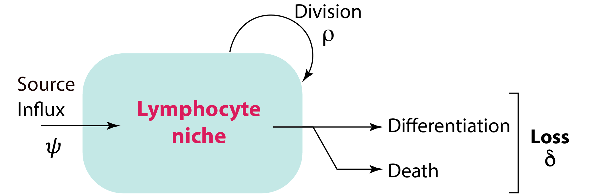
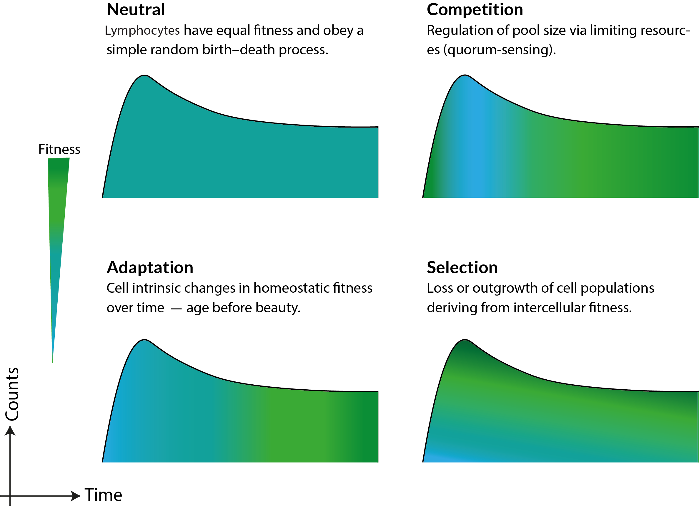
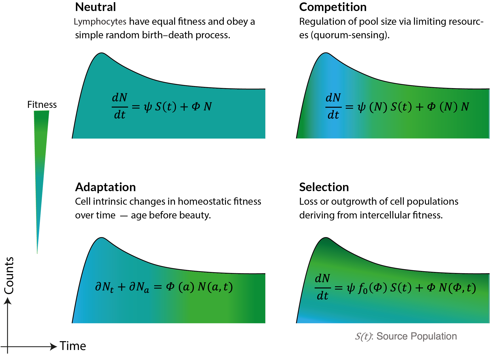
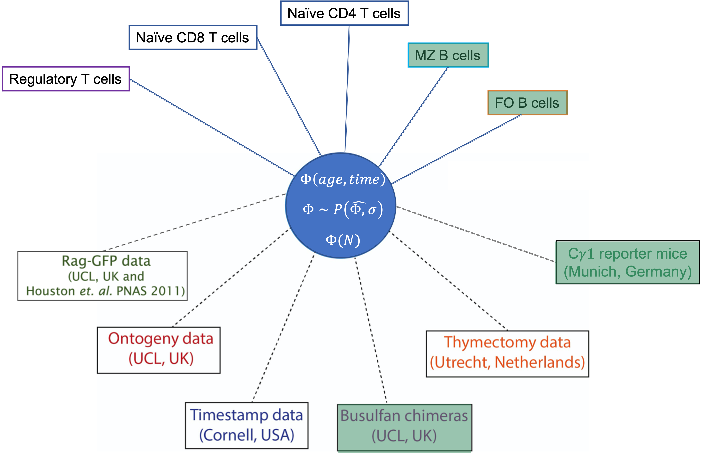

count: false
class: center

```{r setup, include=FALSE}
options(htmltools.dir.version = FALSE)
knitr::opts_chunk$set(warning = FALSE, message = FALSE, 
  comment = NA, dpi = 300,
  fig.align = "center", out.width = "100%", cache = FALSE)
library(tidyverse)
library(knitr)
```

```{r xaringan-themer, include=FALSE, warning=FALSE}
library(xaringanthemer)
style_duo_accent(primary_color = "#006789", secondary_color = "#f7b7bb",
          header_font_google = google_font("Yanone Kaffeesatz"),
          text_font_google   = google_font("IBM PLex Sans", "300", "300i"),
          code_font_google   = google_font("Fira Mono"))
```


## Problem: Perception of unknown

<hr>

```{r echo=FALSE, fig.retina=3, out.width='75%'}

knitr::include_graphics("figures/slide3.png")
```

--

## A system that recognizes foreign and tolerizes self


---

## .center[Accidental wizards:  T and B lymphocytes]
<hr>

**Unique and Specific:**

Repertoire of clones that identify **antigens** through a unique receptor.
  > T cells express T cell receptor (TCR). </br>
  > B cells express antibody molecules (Ig).
  
???
T and B cells that havent encountered antigen yet &rarr;  **Naive** cells.
    > Continuously circulate within lymphatic and blood circulation in search of "specific antigens".

--

 </br>

**Aware of self:**

  > Clones that `recognize` self are **selected positively.** </br>
  > Clones that `recognize` and `react` to self are removed: **negative selection.**

???
Educated in the BM, thymus and spleen to identify self-antigens.
Effector response against pathogens and tumors by secreting Antibodies, Cytokines, Interferon etc.

--

 </br>
 
**React and Remember:**

 >Make more copies Transform into **Effector** cells to curb the infection.  </br>
 >Differentiate into **memory** cells for future encounters.
  
???
class: center, middle

## Broad and long-lasting lymphocyte repertoires are crucial for protection against infections and malignancies throughout our lifetime

???


---

## Immune repertoire diversity
<hr>

Genetic recombination and clonal selection generates and maintains the breadth and specificity of $\sim 10^{12}$ T and B lymphocytes in human body.

--

- T cells: Diversity estimates $10^{15}$ - $10^{61}$ of different combinations of TCR $\alpha\beta$ chains.

- B cells: Theoretical diversity  $>10^{14}$, which is further augmented by somatic hypermutation (SHM) during immune responses.

<br>

.citeR[
Davis and Bjorkman, Nature 1988, Yaari & Kleinstein, Genome Med 2015, <br> Mora and Walzack, arXiv 2016
]

--

<br>

.center[
### Most (if not all) lymphocytes carry unique antigen-specific receptors
]
---

## .center[Problem: Logistics of space and time]

<hr>

.MyBig[
Maintaining `broad` and `long-lasting` repertoires 
]


<br>

```{r echo=FALSE, fig.retina=3, out.width='65%'}


```

---
count:false

class: center, middle, inverse


## How are the numbers and clonal diversity of lymphocyte populations maintained throughout life?

---
class: inverse, center, middle
background-image: url("figures/inverse_bg.png")

## .center[Lymphocyte populations are dynamic ecosystems]

```{r echo=FALSE, fig.retina=3, out.width='90%'}

knitr::include_graphics("figures/intro_eco.png")
```


---

### What happens with age?
<hr>


```{r echo=FALSE, fig.retina=3, out.width='85%'}


```


<br>

.MyBold[Dynamic growth in early life:]
Newly generated lymphocytes populate and adapt to rapidly developing tissues.
  
.MyBold[Stability in adulthood:]
Numbers are maintained stably despite decline in production of Bone-marrow deribed precursors.


.citeR[
Verheijen et al. 2020, Rane et al. Plos Bio 2018, Duchamp et al. Imm Infl Dis 2014, den Braber et al. Immunity 2012, Bains et al. JI 2009
]


---

### What are the rules of replacement within lymphocyte populations? 
<hr>

#### Is replacement purely stochastic? Hierarchy? 

???
- Random displacement? Hierarchy? 

--

-  First-in-**first**-out  &rarr; Conveyor belt?  

- First-in-**last**-out?


???

### Identifying these rules impacts our understanding of lymphocyte maintenance

- Do new immigrants displace pre-existing cells or the relatively older cells have a 'homeostatic advantage'?


--

<br>

.MyBold[
Are lymphocyte restoration therapies beneficial?
]
  >HSC transplant, lymphoablative procedures, Immunodeficiencies  and HIV patients

--

.MyBold[
Heightened vulnerability to infections and cancers:
]
 > An outcome of accumulation of old and incompetent lymphocytes over time?


---

### How do their birth-death processes vary across a lifetime?

<hr>


#### Multiple processes contribute to **establishment** and **maintenance**.  
</h3>

 - Division, death, influx from the precursor, onward differentiation etc.


```{r echo=FALSE, fig.retina=3, out.width='45%'}


```


.MyBold[Homeostatic fitness] $(\Phi)$: The ability of a clone to persist in the population.


---
class: center, middle


### Conceptual mechanisms of lymphocyte maintenance

<hr>


```{r echo=FALSE, fig.retina=3, out.width='85%'}


```


---
count:false
class: center, middle

### Conceptual mechanisms of lymphocyte maintenance

<hr>


```{r echo=FALSE, fig.retina=3, out.width='85%'}


```

---
class: center, middle
<hr>

```{r echo=FALSE, fig.retina=3}

knitr::include_graphics("figures/lambda_global.png")
```

<hr>


---
count:false
class: center, middle
<hr>

```{r echo=FALSE, fig.retina=3}


```

<hr>
---

### Bone marrow chimera mouse model

<hr>

**Tracking donor invasion kinetics in transplant conditioned non-irradiated mice.**

```{r echo=FALSE, fig.retina=3, out.width='90%'}

knitr::include_graphics("figures/buchi_p1.png")
```


---
class: center, middle

<hr>

```{r echo=FALSE, fig.retina=3, out.width='85%'}

knitr::include_graphics("figures/buchi_pw.png")
```

<hr>

---

### Model validation
<hr>

.MyBold[Time-series data:]
At each time point $i$ (>= 1 animal/s), a set of $j$ observations.

<br>

For $i = 0, ..., n$ and $j=1, 2, 3, 4$,

$$
\begin{aligned}
&y_i = (y_{i, 1}, y_{i, 2}, y_{i, 3}, y_{i, 4}) \\
&y_{i} \sim \text{MVN}(\mu_{i}, \Sigma) \quad \quad \quad \quad \quad \quad \quad &[\text{Likelihood}]\\
\\
&\mu_i = (\mu_{i, 1}, \mu_{i, 2}, \mu_{i, 3}, \mu_{i, 4}) \\
&\mu_{i, j} = f_j(i, \theta)  &[\text{Model prediction}]
\end{aligned}
$$

--

<br>

$\theta:$ Vector of parameters within the model.

$\Sigma = diag(\sigma_1^2, \sigma_2^2,, \sigma_3^2, \sigma_4^2,)$ is a covariance matrix.


???

<h3 style="font-size:140%; color:#9e423c;">  Prior  distributions are defined for model parameters &rarr;   &theta;'
</h3>

$$
\begin{aligned}
\text{For example, } \quad \quad
&\theta_1 \sim \text{uniform}(0.0, 1.0)  \\
&... \\
&\theta_n \sim \text{normal}(0.005, 0.01)  \\
\end{aligned}
$$

---

<hr>

<br>

.MyBold[
Posterior distribution $P_{post}(\theta)$ is inferred using the Bayesian approach,
]

Inputs: 
  - $P_{prior}(\theta)$
  - Likelihood function given by the _MVN_ density, 
  


$$
LL = \frac{exp\big({-\frac{1}{2} \, (y_i - \mu_i)^T \, \Sigma^-1 \, (y_i - \mu_i) \big)}}{\sqrt{(2\, \pi)^k \, |\Sigma|}}
$$
--

</br>

.MyBold[Sampling the posterior:]
Parameters are sampled from the joint density $P_{prior}(\theta)$ using **Hamiltonian Monte Carlo** (H-MC) algorithm.

  - Models are coded in the _Stan_ language and fitted using the **NUTS** sampler.
  
<br>

<hr>

???

 - Posterior distributions and model fits are analyzed using _R_ package `rstan`. 

We judge the models under consideration based on **parsimony** and their ability to predict **New observations** which is also called as out of sample prediction error.


.shadedbox2[
Occam's razor:
Models are selected based on **parsimony** and their ability to predict **New observations** &mdash; (out-of-sample prediction error).
]

---
class:center
### Model diagnostics
<hr>

.pull-left[
Sampling
<br>

```{r echo=FALSE, fig.retina=3, out.width="150%"}

knitr::include_graphics("figures/mcmc_fuzzy.png")
```
]

--

.pull-right[

```{r echo=FALSE, fig.retina=3, out.width="65%"}

knitr::include_graphics("figures/Dens_ov.png")
```
]


---
### Estimate of **confidence** in the model
<hr>


.MyBold[Leave-One-Out cross validation:]

```{r echo=FALSE, fig.retina=3, out.width="40%"}

knitr::include_graphics("figures/looic.png")
```


$$
\text{Leave-One-Out information criterion:} \,\,
\small \text{LooIC} = -2 \,\, \sum_{i=1}^n \, Z_i
$$

???
.center[
<h3 style="color:#9e423c; font-size:150%;">
&#8658; LooIC measures the model's ability to predict new data.
</h3>
]


We measure this  out of sample prediction error using Leave-One-Out cross validation, in which a single observation is treated as test dataset and rest of the observations are treated as training data. The process is repeated for all 'n' observations and the prediction error for each left-out test set is aggregated to calculate Leave-One-Out information criterion (LOOIC).

--

$$
\small \Delta \text{LooIC} = \text{LooIC}_i - \text{min}(\text{LooIC})
$$

  - $\small \Delta \text{LooIC} = 0 \Rightarrow$ Best-fit model. 
  - Higher values suggest poorer support from the data.

???
Only relative values of LooIC are meaningful


### Relative support:

<u>Analog of Akaike weight</u>

.shadedbox[
$$
\omega_i = \frac{\exp(-\frac{1}{2} \, [\Delta \text{LooIC}]_i)}{\sum_m^M  \, \exp(-\frac{1}{2} \, [\Delta \text{LooIC}]_m)}
$$
]

- Proportional statistical support among the models under consideration.

???
We then used the estimated LOO-IC values to assess the relative support for models using the analog of the Akaike weight which gives us the probability that a given model will explain new data better than other models considered in this analysis.


---

class: inverse, center, top

### Meta-analysis of diverse datasets selects the adaptation model

<hr>
<br>


```{css, echo=F}
    /* Table width = 100% max-width */
    .remark-slide table{
        width: 100%;
    }
    /* Change the background color to white for shaded rows (even rows) */
    .remark-slide thead, .remark-slide tr:nth-child(n) {
        background-color: white;
    }
```


```{r echo=FALSE, fig.retina=3}
## function for exporting a data table of delta loo ic values and akaike weights
#takes 2 separate lists of the name of the models and loo-ic values
library(kableExtra)
data_vec <- c("Cell counts in Wild Type mice",
              "Cell counts in Thymectomised mice",
              "Dynamics in Busulfan BM chimeras",
              "Kinetics of adoptively transferred cells",
              "Naive T cell acccumulation in early life",
              "Carbon-dating of human naive T cell pool")

df <- data.frame(
  "Dataset" = data_vec,
  "Neutral" = c("\u2714", "\u2717", "\u2717", "\u2717", "\u2717", "NA"),
  "Competition" = c("\u2714", "\u2714", "\u2717", "\u2717", "\u2714",  "NA"),
  "Selection" = c("\u2714", "\u2714", "\u2714", "\u2717", "\u2717",  "NA"),
  "Adaptation" = c("\u2714", "\u2714", "\u2714", "\u2714", "\u2714", "\u2714")
)

df %>%
  kable(align = c("l","c","c","c","c")) %>%
  kable_paper("hover", full_width = F) %>%
  kable_styling(font_size = 20)  

```


### Fitness of naive T cell clones increases with their post-thymic age

.citeR[
<span style="color: white; font-size:115%;"> 
Rane _et. al. eLife_ 2021 <br>
Mold _et. al. Plos Bio_ 2019 <br>
Rane _et. al. Plos Bio_ 2018
</span>
]


---

<hr>

<br>

```{r echo=FALSE, fig.retina=3, out.width='90%'}

knitr::include_graphics("figures/adapt_mod.png")
```


<br>

.MyBold[
We refined the adaptation model to test whether the cell-age dependent effects manifest in either 
]
  - The rate of loss $\delta$: 
    $\quad \quad \;\, \quad \Phi(a) = \rho - \delta(a) \quad$  or
  
  - The rate of division $\rho$: 
   $\quad \quad \Phi(a) = \rho(a) - \delta$


---


### Untangling cell-age effects in division and loss

<hr>


.MyBold[
Equivocal support for age-dependent loss and  age-dependent division models.
]
<br>

placeholders**

```{r echo=FALSE, fig.retina=3, out.width='120%'}

knitr::include_graphics("figures/delta_fits.png")
```

---
class: center, top
### Validating models using out-of-sample predictions approach
<hr>

```{r echo=FALSE, fig.retina=3, out.width='70%'}

knitr::include_graphics("figures/pnas1.png")
```

```{r echo=FALSE, fig.retina=3, out.width='65%'}

knitr::include_graphics("figures/houston_diag.png")
```

.right[
<p style="font-size:90%; color:#595959;">Houston et al. PNAS 2011</p>]

---

### Predictions using the adaptation models
<hr>


Ratio of **young** to **old** co-transferred naive T cells

```{r echo=FALSE, fig.retina=3, out.width='80%'}

knitr::include_graphics("figures/houston_d.png")
```


### Age-dependent division model failed to explain the survival kinetics of naive T cells in the co-transfer experiment.

---

## T cell dynamics in early life
<hr>

### Rag<sup>GFP</sup> Ki67<sup>RFP</sup> mouse model
> GFP is expressed in developmental stages in the Thymus and is turned off upon export to the peripheral lymphoid organs.

<br>

  1. **GFP** expression on cells is diluted  by,
   - .MyBold[Cellular ageing:] exponential decline as GFP gets degraded within cells.
 
   - .MyBold[Cell-division:] GFP is distributed equally between progeny.
   
  2. **Ki67** expression is proxy for recent division. 


---
class: center

### Out-of-sample predictions of neonatal T cell dynamics

<hr>


```{r echo=FALSE, fig.retina=3, out.width='75%'}

knitr::include_graphics("figures/Ontogeny_preds2.png")
```


.MyBold[Distinct dynamics of naive CD8 T cells in neonates and adults.]

---
class: inverse

<hr>
</br>


```{r echo=FALSE, fig.retina=3, out.width='750'}

knitr::include_graphics("figures/timestamp_paper.png")
```

</br>

???
count: false

class: center, middle

### A good test of a model is its versatility in explaining multiple datasets generated in diverse experimental settings.

<p style="color:navy;">A good test of a model is its versatility in explaining multiple datasets generated in diverse experimental settings.</p>

--

```{r echo=FALSE, fig.retina=3, out.width='750px'}

knitr::include_graphics("figures/ts_strategy1.png")
```

<hr>
---

<hr>

```{r echo=FALSE, fig.retina=3, out.width='55%'}

knitr::include_graphics("figures/tmstmp_data.jpeg")
```

???
What can we eyeball here?
1. Looks like new cells in older mice are lost at a lower rate initially (slope of purple data)
2. Hint that numbers are not decaying exponentially (would be straight lines on log scale),
which suggests survival changes with cell age

--

</br>

### Hierarchical adaptation models:

.MyBold[Assumption:] 

Initial pool size $N_0$ and/or cellular fitness $\Phi$ varies;
 > Among cohorts and/or <br>
 > Individual animals.


---
class: center. middle


Placeholder**
```{r echo=FALSE, fig.retina=3}

knitr::include_graphics("figures/tmstmp_fit.jpg")
```


---
class: inverse, center

### Variation in the initial counts
<hr>

</br>
```{r echo=FALSE, fig.retina=3}

knitr::include_graphics("figures/tmstmp_N0.jpeg")
```


---

### Variation in cellular fitness
<hr>

.pull-left[
```{r echo=FALSE, fig.retina=3, out.width='90%'}

knitr::include_graphics("figures/lambda_var_cohorts.jpeg")
```
]

--

.pull-right[
```{r echo=FALSE, fig.retina=3, out.width='90%'}

knitr::include_graphics("figures/lambda_varHA_Sigmoid.jpeg")
```


<br>

$$
\begin{aligned}
\Phi(t, a) = \, &\Phi_h \, \bigg(1 + \frac{Q}{1 + (t/q1)^5} \bigg) \, e^{-r \, a}\\
&----  \Phi_0 ----
\end{aligned}
$$

]
---

### Out-of-sample predictions of neonatal T cell dynamics

<hr>

#### The loss rate of naive CD8 T cells varies with,
 > Age of the mouse and <br>
 > Time since their ancestors left thymus

</br>


```{r echo=FALSE, fig.retina=3, out.width='750'}

knitr::include_graphics("figures/Hostage_ASM.png")
```


---

### Insights into naive T cell homeostasis
<hr>


1. Naive T cells **divide rarely**.
  
  - Inter-division times for:
  
    > -  CD4 T cells &approx; 18 mo (CI: 16-22)
    > -  CD8 T cells &approx; 14 mo (CI: 12-26)
  
--

2. Their **life-expectancy** increases with cell-age.
  
  - Mean lifespan of youngest cells:
  
    > - CD4 T cells &approx; 3 wk (CI: 2.5-4)
    > - CD8 T cells &approx; 3 mo (CI: 2.5-4.5)

  - Time taken for lifespan to double: 
   
    > - CD4 T cells &approx; 6 wk (CI: 5-7)
    > - CD8 T cells &approx; 5 mo (CI: 3.5-7)
    
    
<br>

<hr>


---

### Acknowledgements
<hr>


