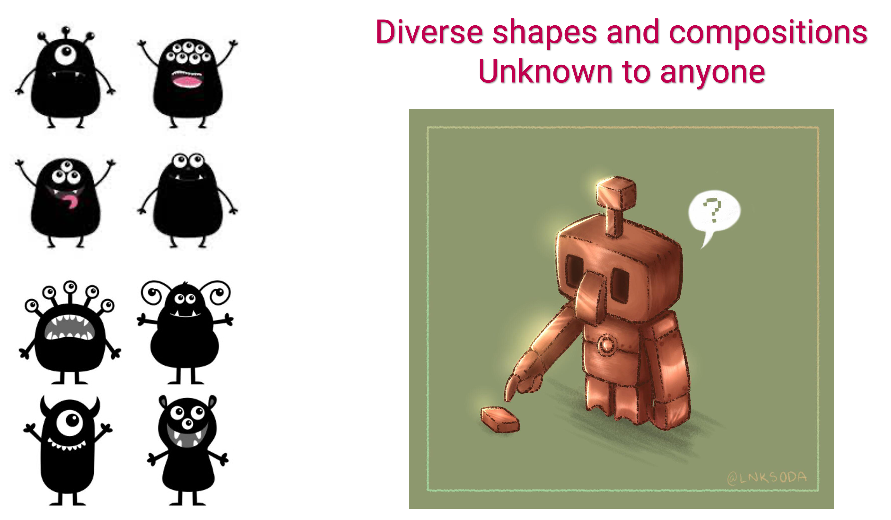
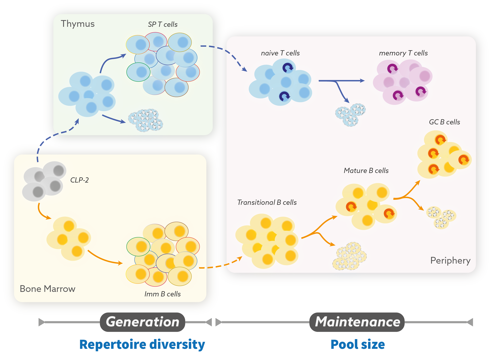
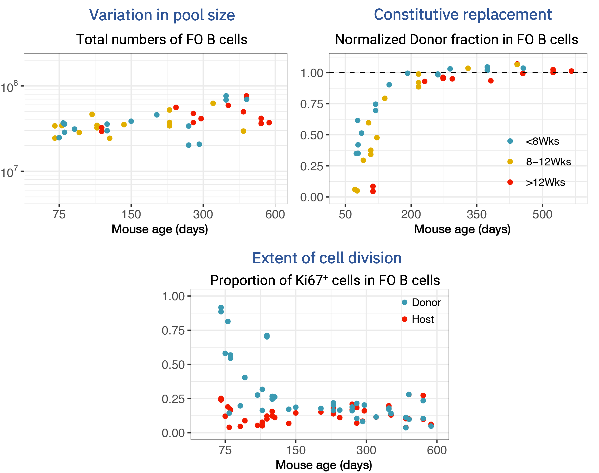
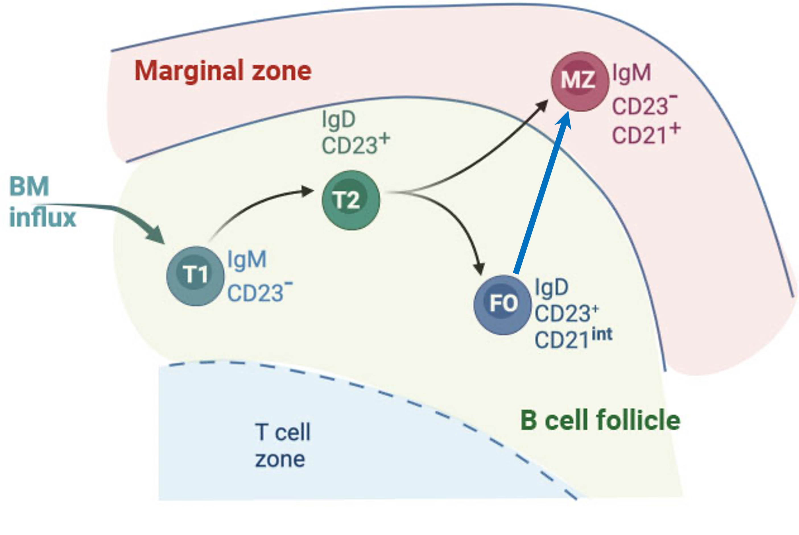
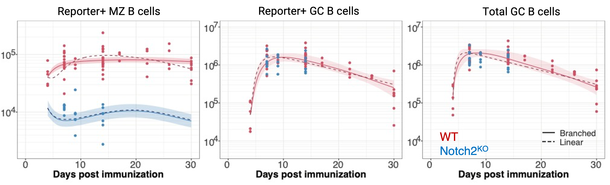
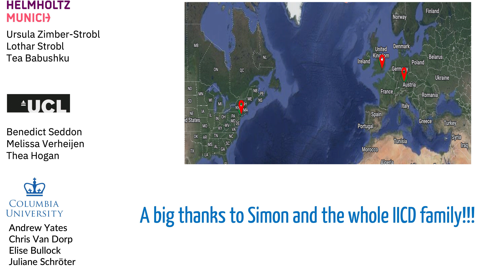

count: false
class: center

```{r setup, include=FALSE}
options(htmltools.dir.version = FALSE)
knitr::opts_chunk$set(warning = FALSE, message = FALSE, 
  comment = NA, dpi = 300,
  fig.align = "center", out.width = "100%", cache = FALSE)
library(tidyverse)
library(knitr)
```

```{r xaringan-themer, include=FALSE, warning=FALSE}
library(xaringanthemer)
style_duo_accent(primary_color = "#006789", secondary_color = "#f7b7bb",
          header_font_google = google_font("Yanone Kaffeesatz"),
          text_font_google   = google_font("IBM PLex Sans", "300", "300i"),
          code_font_google   = google_font("Fira Mono"))
```


.center[
## Thought experiment: Perception of unknown
]
<hr>

```{r echo=FALSE, fig.retina=3, out.width='65%'}


```

--

<br>

## A system that recognizes foreign and tolerizes self


---

## .center[Wizards of our immune system:  T and B lymphocytes]
<hr>

**Hugely diverse and specific:**

Repertoire of clones that identify **antigens** through diverse receptor.
  > T cells express T cell receptor (TCR). </br>
  > B cells express antibody molecules (Ig).
 
--

 </br>

**Aware of self:**

  > Clones that `recognize` self are **selected positively.** </br>
  > Clones that `recognize` and `react` to self are removed: **negative selection.**

--

 </br>
 
**React and Remember:**

 >Proliferate and transform into **Effector** cells to curb the infection.  </br>
 >Differentiate into **memory** cells  protect against re-exposure.
  

---

## Immune repertoire diversity
<hr>

Genetic recombination and clonal selection generates and maintains the breadth and specificity of $\sim 10^{12}$ T and B lymphocytes in human body.

--

- T cells: Diversity estimates $10^{15}$ - $10^{61}$ of different combinations of TCR $\alpha\beta$ chains.

- B cells: Theoretical diversity  $>10^{14}$ Ig receptors; augmented by somatic hypermutation (SHM) during immune responses.

<br>

.citeR[
Davis and Bjorkman, Nature 1988, Yaari & Kleinstein, Genome Med 2015, <br> Mora and Walzack, arXiv 2016
]

--

<br>

.center[
### Most (if not all) naive lymphocytes carry unique receptors
]
---

## .center[Problem: Space-time logistics]

<hr>

.MyBig[
Maintaining `broad` and `long-lasting` repertoires 
]


<br>

```{r echo=FALSE, fig.retina=3, out.width='65%'}

knitr::include_graphics("figures/robot_repertoire.jpg")
```

---
count:false

class: center, middle, inverse

<br>

## 1. How are the numbers and clonal diversity of lymphocyte populations maintained throughout life?

--


<br>


## 2. To what extent do the rules governing B cell dynamics vary upon immunogenic perturbations?

---
class: inverse, center, middle
background-image: url("figures/inverse_bg.png")

## .center[Lymphocyte populations are dynamic ecosystems]

```{r echo=FALSE, fig.retina=3, out.width='90%'}


```


---

### How do their birth-death processes vary across a lifetime?

<hr>


#### Multiple processes contribute to **establishment** and **maintenance**.  
</h3>

 - Division, death, influx from the precursor, onward differentiation etc.


```{r echo=FALSE, fig.retina=3, out.width='55%'}

knitr::include_graphics("figures/homeostasis_processes.png")
```

<br>


.MyBold[Homeostatic fitness] $\Phi = \rho - \delta$  
> The ability of a clone to persist in the population.


---

### Variation with age
<hr>


```{r echo=FALSE, fig.retina=3, out.width='90%'}


```


<br>

.MyBold[Dynamic growth in early life:]
Newly generated lymphocytes populate and adapt to rapidly developing tissues.
  
.MyBold[Stability in adulthood:]
Numbers are maintained stably despite decline in production of Bone-marrow deribed precursors.


.citeR[
Verheijen et al. 2020, Rane et al. Plos Bio 2018
]

---

### What are the rules of replacement within lymphocyte populations? 
<hr>

#### Is replacement purely random? Or is there a residence hierarchy? 

--

-  First-in-**first**-out  &rarr; Conveyor belt?  

- First-in-**last**-out? &rarr; age before beauty?  


--

<br>

.MyBold[
Are lymphocyte restoration therapies beneficial?
]
  >HSC transplant, lymphoablative procedures, Immunodeficiencies  and HIV patients

--

.MyBold[
Heightened vulnerability to infections and cancers:
]
 > An outcome of accumulation of old and incompetent lymphocytes over time?


---

class: center, middle


### Conceptual mechanisms of lymphocyte maintenance

<hr>


```{r echo=FALSE, fig.retina=3, out.width='85%'}

knitr::include_graphics("figures/model_concepts.png")
```


---
count:false
class: center, middle

### Conceptual mechanisms of lymphocyte maintenance

<hr>

```{r echo=FALSE, fig.retina=3, out.width='85%'}

knitr::include_graphics("figures/model_concepts2.png")
```

---

class: center, middle
### Confronting models with data from diverse experimental systems
<hr>


```{r echo=FALSE, fig.retina=3, out.width='75%'}


```

<br>

.citeR[
Rane _et. al. eLife_ 2021, Verheijn _et. al._ Cell Reports 2020, <br>
Mold _et. al. Plos Bio_ 2019, Rane _et. al. Plos Bio_ 2018
</span>
]


---
count:false
class: center, middle
### Confronting models with data from diverse experimental systems
<hr>


```{r echo=FALSE, fig.retina=3, out.width='75%'}

knitr::include_graphics("figures/lambda_global2.png")
```

<br>

.citeR[
Rane _et. al. eLife_ 2021, Verheijn _et. al._ Cell Reports 2020, <br>
Mold _et. al. Plos Bio_ 2019, Rane _et. al. Plos Bio_ 2018
</span>
]
---

## B cell maturation in the spleen
<hr>

- B cells transition through **short-lived** developmental stages in the spleen.


- Late-stage transitional (T2) B cells bifurcate into fully mature Follicular (FO) or Marginal Zone (MZ) B cells.

<br>


```{r echo=FALSE, fig.retina=3, out.width='55%'}

knitr::include_graphics("figures/bcell_matu.jpg")
```

---

## Division of labour and space
<hr>

<!---
#### Division of labour within B cells
--->

<h4 style="color:#006789; font-size:100%"> 
Marginal Zone is an anatomical barrier that divides lymphocyte-rich follicles and the erythrocyte-rich red pulp.
</h4>

.pull-left[
```{r echo=FALSE, fig.retina=3, out.width='100%'}

knitr::include_graphics("figures/MZ_viz1.jpg")
```

.right[*Zimber-Strobl group* 
<p style="font-size:90%; color:#595959;">Lechner et al Nat Comm 2021 </p>
]

]

???
5 % of circulation goes through spleen
blood cicrulation opens into marginal sinus where blood slows down so that Mphages and B cells guarding the sinus can filter it for antigens/pathogens.

--

.pull-right[


- FO B cells typically respond to antigens presented by Dendritic cells and Macrophages in a **T cell dependent manner** and produce high-affinity antibodies.
{{content}}

]


--


- MZ B cells are strategically positioned to identify and respond to **blood-borne** antigens. 
<h4 style="color:#9e423c;">&#8658; Gatekeepers of the immune system.</h4>


---

### Temporal fate-mapping: A window into lymphocyte dynamics
<hr>

#### **Tracking donor invasion kinetics in transplant conditioned non-irradiated mice.**

<br>

```{r echo=FALSE, fig.retina=3, out.width='75%'}

knitr::include_graphics("figures/buchi_diag.jpg")
```

<br>

.citeR[
Seddon group UCL, UK
]
---
class: center, middle

.middle[
```{r echo=FALSE, fig.retina=3, out.width="100%"}


```
]


---

### Model validation
<hr>

.MyBold[Time-series data:]
At each time point $i$ (>= 1 animal/s), a set of $j$ observations.

<br>

For $i = 0, ..., n$ and $j=1, 2, 3, 4$,

$$
\begin{aligned}
&y_i = (y_{i, 1}, y_{i, 2}, y_{i, 3}, y_{i, 4}) \\
&y_{i} \sim \text{MVN}(\mu_{i}, \Sigma) \quad \quad \quad \quad \quad \quad \quad &[\text{Likelihood}]\\
\\
&\mu_i = (\mu_{i, 1}, \mu_{i, 2}, \mu_{i, 3}, \mu_{i, 4}) \\
&\mu_{i, j} = f_j(i, \theta)  &[\text{Model prediction}]
\end{aligned}
$$


<br>

$\theta:$ Vector of parameters within the model.

$\Sigma = diag(\sigma_1^2, \sigma_2^2,, \sigma_3^2, \sigma_4^2,)$ is a covariance matrix.


---
### Estimate of **confidence** in the model
<hr>


.MyBold[Leave-One-Out cross validation:]

```{r echo=FALSE, fig.retina=3, out.width="35%"}

knitr::include_graphics("figures/looic.png")
```


$$
\text{Leave-One-Out information criterion:} \,\,
\small \text{LooIC} = -2 \,\, \sum_{i=1}^n \, log(Z_i)
$$

--


.MyBold[Model ranking:]
<u>Analog of Akaike weight</u>

.shadedbox[
$$
\omega_i = \frac{\exp(-\frac{1}{2} \, [\Delta \text{LooIC}]_i)}{\sum_m^M  \, \exp(-\frac{1}{2} \, [\Delta \text{LooIC}]_m)}
$$
]

---

class: center, middle

### Neutral model explains MZ B cell dynamics
<hr>

.middle[
```{r echo=FALSE, fig.retina=3, out.width="85%"}

knitr::include_graphics("figures/MZ_fits.png")
```
]

---
class: center, middle

### Time (Host age) dependence in FO B cell dynamics
<hr>

.middle[
```{r echo=FALSE, fig.retina=3, out.width="85%"}


```
]


---
class: 

### Insights into naive B cell homeostasis
<hr>


#### Naive B cells divide **very rarely.**
  - Inter-division times FO B cells &approx;  > 1 year (CI: 0.6-23)
  - Inter-division times MZ B cells &approx;  $\sim6$ months (CI: 4-7)
  
  
--

#### Life-expectancy  of FO B cells increases with mouse age.
  - Mean lifespan in a
    > 10 wk old mouse &approx;  35 days (CI: 2.5-4) </br>
    > 2 year old mouse &approx;  61 days


#### Mean residence time of MZ B cells &approx; $\sim64$ days (CI: 54-72) </br>
    
--

#### Constitutive replenishment
  - $\sim$ 3% of FO and  $\sim$ 1.2% of MZ B is replaced daily by source influx.
  

<br>

### FO B cells are a homogeneous, slowly dividing population whose lifespan increases with host age

.citeR[
Verheijn _et. al._ Cell Reports 2020
]
---

<br>

<s> 
##1. How are the numbers and clonal diversity of lymphocyte populations maintained throughout life?
</s>

<br>

## 2. To what extent do the rules governing B cell dynamics vary upon immunogenic perturbations?

---
## Immune-response dynamics of B lymphocytes

<hr>

**C<sub>&gamma;1</sub>Cre reporter mice** immunized with NP-CGG antigen.

- Responding B cells permanently express the reporter protein.

<br>


```{r echo=FALSE, fig.retina=3, out.width='40%'}


```

.center[
### De Novo generation of MZ B cells from activated B cells
]
.citeR[
Babushku _et. al._ under revision in _Nature Communications_
]

---

class:center

### Dynamical modelling of antigen-specific B cell response
<hr>


```{r echo=FALSE, fig.retina=3, out.width='60%'}


```

--

```{r echo=FALSE, fig.retina=3, out.width='105%'}


```


### Activated FO B cells bifurcate into GC and MZ B cells fates


???
Model weights:
 > Branched Model = 80% <br>
 > Linear model = 7% <br>
 > Null model = 14%
 
 <br>
 

```{r echo=FALSE, fig.retina=3, out.width='105%'}


```

.citeR[
Babushku _et. al._
]

---


class: top

.center[
### Next step: Lineage tracing to dissect B cell differentiation 
]
<hr>

.pull-left[

```{r echo=FALSE, fig.retina=3, out.width='65%'}


```

]


.pull-right[

<br>

1. Single-cell Ig-repertoire cite-sequencing of responding cells. 

2. Track the antigen-specific clones using patterns of somatic hypermutation.

3. .MyBold[
Infer clonal diversification pathways.
]
]
<br>

<br>
.citeR[
In collaboration with Ströbl group (Helmholtz Zentrum, Munich) and <br>
Kleinstein lab (Yale Univ. USA)
]


---

###  Connecting population averages to clonal dynamics


<hr>

#### Parameter estimates derived from the dynamical modeling of B cell response
  - _Per capita_ rate of influx from activated FO B into the MZ pool: $\alpha$ <br>
  - Rate of net loss of MZ B cells: $\lambda$


<br>

#### Stochastic simulation
If at time $t$, the number of activated FO B cells: F(t). 

In the next small time interval $h$,


- Number of new clones recruited into the MZ = $\alpha$ * F(t) * h, 

- Clones are recruited with the **uniform probability**.
  
- Clones are lost from the pool with a **binomial probability** of $1- e^{-\lambda \, h}$ 

---
class: center, middle, inverse

<hr>
<br>

### Power law distribution of clone-sizes in activated FO B cells

```{r echo=FALSE, fig.retina=3, out.width='75%'}


```

<br>
<hr>
---

### Prediction of the clonal structure of MZ B cells
<hr>

```{r echo=FALSE, fig.retina=3, out.width='75%'}


```

--


#### Neutral Dynamics predicts direct mapping of MZ B clonal structure on to the clonal distribution in FO B cells.

.MyBold[
Any departure from this in experimental observations:
]
- Clone specific differences in **Recruitment** or
**Retention** in MZ?

- Archiving of memory of GC-derived clones in MZ?

---


---
count: false
class: center, middle


```{r echo=FALSE, fig.retina=3, out.width= '95%'}


```


---
count: false
class: center, middle

## Happy (belated) birthday Simon!

```{r echo=FALSE, fig.retina=3, out.width= '60%'}


```


---


